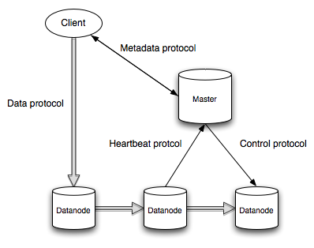

# BFS: A distributed filesystem in Bloom

In this document we'll use what we've learned to build a piece of systems software using Bloom.  The libraries that ship with BUD provide many of the building blocks we'll need to create a distributed,
``chunked'' filesystem in the style of the Google Filesystem(GFS):

 * a [key-value store](https://github.com/bloom-lang/bud-sandbox/blob/master/kvs/kvs.rb), 
 * [nonce generation](https://github.com/bloom-lang/bud-sandbox/blob/master/ordering/nonce.rb)
 * a [heartbeat protocol](https://github.com/bloom-lang/bud-sandbox/blob/master/heartbeat/heartbeat.rb)

## High-level architecture

## Basic Filesystem

Before we worry about any of the details of distribution, we need to implement the basic filesystem metadata operations: _create_, _remove_, _mkdir_ and _ls_.
There are many choices for how to implement these operations, and it makes sense to keep them separate from the (largely orthogonal) distributed filesystem logic.
That way, it will be possible later to choose a different implementation of the metadata operations without impacting the rest of the system.

    module FSProtocol
      state do
        interface input, :fsls, [:reqid, :path]
        interface input, :fscreate, [] => [:reqid, :name, :path, :data]
        interface input, :fsmkdir, [] => [:reqid, :name, :path]
        interface input, :fsrm, [] => [:reqid, :name, :path]
        interface output, :fsret, [:reqid, :status, :data]
      end
    end

We create an input interface for each of the operations, and a single output interface for the return for any operation: given a request id, __status__ is a boolean
indicating whether the request succeeded, and __data__ may contain return values (e.g., _fsls_ should return an array containing the array contents).

We already have a library that provides an updateable flat namespace: the key-value store.  We can easily implement the tree structure of a filesystem over a key-value store
in the following way:

 1. keys are paths
 2. directories have arrays containing child entries (base names)
 3. files values are their contents

Note that (3) will cease to apply when we implement chunked storage later.  So we begin our implementation of a KVS-backed metadata system in the following way:

    module KVSFS
      include FSProtocol
      include BasicKVS

If we wanted to replicate the metadata master, we could consider mixing in a replicated KVS implementation instead of __BasicKVS__ -- but more on that later.
The directory listing operation is very simple:

      bloom :elles do
        kvget <= fsls.map{ |l| [l.reqid, l.path] }
        fsret <= join([kvget_response, fsls], [kvget_response.reqid, fsls.reqid]).map{ |r, i| [r.reqid, true, r.value] }
        fsret <= fsls.map do |l|
          unless kvget_response.map{ |r| r.reqid}.include? l.reqid
            [l.reqid, false, nil]
          end
        end
      end

If we get a __fsls__ request, probe the key-value store for the requested by projecting _reqid_, _path_ from the __fsls__ tuple into __kvget__.  If the given path
is a key, __kvget_response__ will contain a tuple with the same _reqid_, and the join on the second line will succeed.  In this case, we insert the value
associated with that key into __fsret__.  Otherwise, the third rule will fire, inserting a failure tuple into __fsret__.

The logic for file and directory creation and deletion follow a similar logic with regard to the parent directory.  Unlike a directory listing, these operations change
the state of the filesystem.  In general, any state change will invove carrying out two mutating operations to the key-value store atomically:

 1. update the value (child array) associated with the parent directory entry
 2. update the key-value pair associated with the object in question (a file or directory being created or destroyed).

        dir_exists = join [check_parent_exists, kvget_response, nonce], [check_parent_exists.reqid, kvget_response.reqid]
    
        check_is_empty <= join([fsrm, nonce]).map{|m, n| [n.ident, m.reqid, terminate_with_slash(m.path) + m.name] }
        kvget <= check_is_empty.map{|c| [c.reqid, c.name] }
        can_remove <= join([kvget_response, check_is_empty], [kvget_response.reqid, check_is_empty.reqid]).map do |r, c|
          [c.reqid, c.orig_reqid, c.name] if r.value.length == 0
        end
    
        fsret <= dir_exists.map do |c, r, n|
          if c.mtype == :rm
            unless can_remove.map{|can| can.orig_reqid}.include? c.reqid
              [c.reqid, false, "directory #{} not empty"]
            end
          end
        end
    
        # update dir entry
        # note that it is unnecessary to ensure that a file is created before its corresponding
        # directory entry, as both inserts into :kvput below will co-occur in the same timestep.
        kvput <= dir_exists.map do |c, r, n|
          if c.mtype == :rm
            if can_remove.map{|can| can.orig_reqid}.include? c.reqid
              [ip_port, c.path, n.ident, r.value.clone.reject{|item| item == c.name}]
            end
          else
            [ip_port, c.path, n.ident, r.value.clone.push(c.name)]
          end
        end
    
        kvput <= dir_exists.map do |c, r, n|
          case c.mtype
            when :mkdir
              [ip_port, terminate_with_slash(c.path) + c.name, c.reqid, []]
            when :create
              [ip_port, terminate_with_slash(c.path) + c.name, c.reqid, "LEAF"]
          end
        end

## File Chunking

Now that we have a module providing a basic filesystem, we can extend it to support chunked storage of file contents.  To do this, we add a few metadata operations
to those already defined by FSProtocol:

    module ChunkedFSProtocol
      include FSProtocol
    
      state do
        interface :input, :fschunklist, [:reqid, :file]
        interface :input, :fschunklocations, [:reqid, :chunkid]
        interface :input, :fsaddchunk, [:reqid, :file]
        # note that no output interface is defined.
        # we use :fsret (defined in FSProtocol) for output.
      end
    end

 * __fschunklist__ returns the set of chunks belonging to a given file.  
 * __fschunklocations__ returns the set of datanodes in possession of a given chunk.
 * __fsaddchunk__ returns a new chunkid for appending to an existing file, guaranteed to be higher than any existing chunkids for that file.

We continue to use __fsret__ for return values.

## Datanodes and Heartbeats

### I am autogenerated.  Please do not edit me.
